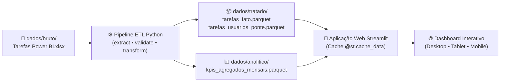

<div align="center">

# 🏢 Comercial Saavedra — Business Intelligence & CRM Analytics

[](https://www.python.org/)
[](https://streamlit.io/)
[](https://plotly.com/)
[](https://parquet.apache.org/)
[](LICENSE)

**Plataforma analítica e arquitetura de dados moderna para gestão da força de vendas, produtividade em campo e cobertura hospitalar do CRM Ploomes.**

[Visão Geral](#-visão-geral) • [Arquitetura](#-arquitetura-do-projeto) • [KPIs da Gestão](#-kpis-gerenciais-implementados) • [Como Executar](#-como-executar-localmente) • [Deploy Online](#-deploy-e-link-externo-streamlit-cloud) • [Licença](#-licença)

</div>

---

## 📌 Visão Geral

O projeto **Comercial Saavedra** é uma solução completa de engenharia e análise de dados desenvolvida para transformar dados operacionais do CRM (Ploomes) em inteligência de negócios para tomada de decisão gerencial.

A plataforma substitui o consumo lento de planilhas Excel por uma **camada colunar em Apache Parquet** e uma aplicação analítica interativa em **Python + Streamlit + Plotly**, com carregamento instantâneo (< 5 ms) e governança rigorosa.

---

## 🏗️ Arquitetura do Projeto

A solução adota uma arquitetura desacoplada em três camadas:



### Principais Diferenciais Técnicos:
1. **Desacoplamento Completo:** A aplicação web nunca acessa o arquivo bruto diretamente, evitando travamentos de concorrência.
2. **Armazenamento Colunar (Parquet + Snappy):** Compressão de dados eficiente com preservação estrita de tipagem (`Date`, `Time`, `Boolean`, `Int64`, `Float64`).
3. **Invalidação Dinâmica de Cache (`mtime`):** O Streamlit detecta automaticamente quando os arquivos Parquet são atualizados pelo ETL e recarrega os dados sem necessidade de reiniciar o servidor.
4. **Resolução de Relações N:N:** Tabela-ponte despivotada para tarefas com múltiplos vendedores participantes.

---

## 🎯 KPIs Gerenciais Implementados

O painel atende diretamente às 8 perguntas estratégicas da diretoria comercial:

| Indicador Estratégico | Localização no App | Descrição e Regra de Negócio |
| :--- | :--- | :--- |
| **Total de Tarefas Realizadas por Vendedor** | `👥 Vendedores & Equipe` | Volume de participações totais de cada consultor comparado com tarefas como titular. |
| **Total de Tarefas Finalizadas por Vendedor** | `👥 Vendedores & Equipe` | Tarefas concluídas e respectiva taxa de efetividade de execução (`% Conclusão`). |
| **Top Clientes com Mais Tarefas** | `🏥 Clientes & Negócios` | Ranking dos hospitais e clínicas com maior intensidade de relacionamento comercial. |
| **Tarefas em Atraso ⚠️** | `Visão Geral` & `Vendedores` | Auditoria de tarefas com data expirada que ainda não receberam baixa no CRM. |
| **Médias de Tarefas Diárias** | `Visão Geral` & `Vendedores` | Média de tarefas realizadas por dia em que o vendedor/empresa esteve em atividade. |
| **Tempo sem Tarefas na Semana** | `👥 Vendedores & Equipe` | Média de dias úteis (Seg-Sex) em que o consultor não registrou atividade de campo. |
| **Duração & Horas de Atendimento** | `Visão Geral` & `Vendedores` | Carga horária total dedicada a clientes e duração média de visitas presenciais. |
| **Conformidade de Contatos** | `👥 Vendedores & Equipe` | Percentual de tarefas em que o vendedor cadastrou o nome do interlocutor clínico. |
| **Sincronização Google Calendar** | `👥 Vendedores & Equipe` | Percentual de tarefas integradas com agendas corporativas via e-mail. |
| **Negócios & Oportunidades** | `🏥 Clientes & Negócios` | Distribuição de esforço por oportunidade comercial trabalhada. |

---

## 📁 Estrutura de Diretórios

```
comercial-saavedra/
├── app.py                           # Ponto de entrada raiz para execução do Streamlit
├── requirements.txt                 # Dependências do projeto para deploy
├── LICENSE                          # Licença de uso MIT
├── README.md                        # Documentação executiva
│
├── app/                             # Aplicação Web Analítica
│   ├── app.py                       # Dashboard executivo principal
│   ├── config/                      # Configurações globais, paleta visual e caminhos
│   ├── data/                        # Carregador de dados com cache inteligente (@st.cache_data)
│   ├── filters/                     # Filtros unificados da barra lateral (Padrão: Últimos 30 Dias)
│   ├── components/                  # Cards de KPIs, alertas e cabeçalhos visuais
│   ├── analytics/                   # Funções puras de cálculo de métricas e agregações
│   ├── charts/                      # Gráficos interativos Plotly (linhas, rankings, roscas, heatmap)
│   ├── utils/                       # Exportador para CSV (pt-BR com BOM) e Excel (.xlsx)
│   └── pages/                       # Módulos analíticos navegáveis
│       ├── 1_Visao_Geral.py         # Painel executivo consolidado
│       ├── 2_Vendedores_e_Equipe.py # Produtividade, horas, atrasos e ociosidade semanal
│       ├── 3_Clientes_e_Negocios.py # Cobertura de contas hospitalares e oportunidades
│       ├── 4_Analise_Temporal.py    # Sazonalidade, horários de pico e lead time
│       └── 5_Detalhamento_Operacional.py # Tabela dinâmica com busca e exportação
│
├── etl/                             # Pipeline de Engenharia de Dados
│   ├── extract.py                   # Extração da planilha bruta do Excel
│   ├── validate.py                  # Validação de schema e integridade referencial
│   ├── transform.py                 # Saneamento, Surrogate Keys, desaninhamento e novas métricas
│   └── load.py                      # Persistência colunar em Parquet
│
├── dados/
│   ├── bruto/                       # Planilha original (Tarefas Power BI.xlsx)
│   ├── tratado/                     # tarefas_fato.parquet, tarefas_usuarios_ponte.parquet
│   └── analitico/                   # kpis_agregados_mensais.parquet
│
└── documentacao/                    # Auditoria técnica e governança
    ├── arquitetura_app.md           # Manual de arquitetura, execução e deploy
    ├── inventario_base.md           # Inventário estrutural do arquivo bruto
    ├── analise_exploratoria.md      # Perfil estatístico detalhado
    ├── chaves_e_relacionamentos.md  # Modelagem dimensional e testes de chaves
    ├── granularidade.md             # Comprovação da granularidade de tarefas
    ├── qualidade_dados.md           # Matriz de anomalias (Crítico, Alto, Médio, Baixo)
    └── scripts_analise/             # Scripts Python reproduzíveis de auditoria
```

---

## 🚀 Como Executar Localmente

### Pré-requisitos
* Python 3.10 ou superior instalado.

### 1. Clonar o Repositório e Instalar Dependências
```bash
git clone https://github.com/SEU_USUARIO/comercial-saavedra.git
cd comercial-saavedra
pip install -r requirements.txt
```

### 2. Executar o Pipeline de Dados (ETL)
Gera os arquivos Parquet tratados a partir do arquivo bruto em `dados/bruto/`:
```bash
python -m etl.load
```

### 3. Iniciar o Dashboard Streamlit
```bash
streamlit run app.py
```
Acesse no seu navegador: **`http://localhost:8501`**

---

## 🌐 Deploy e Link Externo (Streamlit Community Cloud)

Para disponibilizar a aplicação online gratuitamente via **Streamlit Cloud** com link público/corporativo:

1. **Suba este repositório para o seu GitHub:**
   ```bash
   git add .
   git commit -m "feat: implementacao completa do dashboard comercial saavedra"
   git branch -M main
   git remote add origin https://github.com/SEU_USUARIO/comercial-saavedra.git
   git push -u origin main
   ```

2. **Conecte no Streamlit Community Cloud:**
   * Acesse [share.streamlit.io](https://share.streamlit.io/) e faça login com sua conta GitHub.
   * Clique em **"New app"**.
   * Selecione:
     * **Repository:** `SEU_USUARIO/comercial-saavedra`
     * **Branch:** `main`
     * **Main file path:** `app.py`
   * Clique em **"Deploy!"**.

3. **Pronto!** Em poucos segundos você receberá um link público seguro (ex: `https://comercial-saavedra.streamlit.app`) para compartilhar com a diretoria e os gestores.

---

## 📄 Licença

Este projeto é distribuído sob a licença **MIT**. Consulte o arquivo [LICENSE](LICENSE) para obter mais informações.

---

<div align="center">
Desenvolvido para <b>Comercial Saavedra</b> • 2026
</div>
