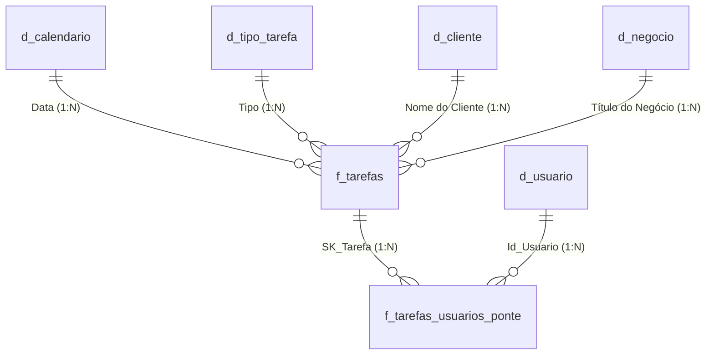

# Chaves e Relacionamentos - Comercial Saavedra

Este documento analisa a integridade referencial, candidatas a chaves primárias e alternativas de modelagem de relacionamentos a partir da tabela bruta `Ploomes`.

---

## 1. Investigação de Chaves Primárias (PK)

Nenhuma coluna do arquivo original foi aceita a priori como chave. Todas as colunas e combinações foram testadas contra as 1.083 linhas de dados reais.

### 1.1. Teste de Unicidade em Colunas Individuais

| Coluna | Total Linhas | Valores Válidos | Distintos | Nulos | % Unicidade | Conclusão |
| :--- | :---: | :---: | :---: | :---: | :---: | :--- |
| `Data de criação` | 1.083 | 1.083 | 987 | 0 | 91,14% | **Rejeitada** (25 timestamps duplicados em lote) |
| `Data` | 1.083 | 1.083 | 927 | 0 | 85,60% | **Rejeitada** (Múltiplas tarefas no mesmo horário) |
| `Título` | 1.083 | 1.069 | 872 | 14 | 80,52% | **Rejeitada** (Títulos repetidos e 14 nulos) |
| `Descrição` | 1.083 | 410 | 384 | 673 | 35,46% | **Rejeitada** (62% nula e descrições repetidas) |
| `Título do Negócio`| 1.083 | 1.083 | 188 | 0 | 17,36% | **Rejeitada** (Muitas tarefas no mesmo negócio) |
| `Nome do Cliente` | 1.083 | 1.082 | 77 | 1 | 7,11% | **Rejeitada** (Muitas tarefas no mesmo cliente) |
| `Usuários` | 1.083 | 1.083 | 74 | 0 | 6,83% | **Rejeitada** (Usuários repetidos e agrupados) |
| `Marcadores` | 1.083 | 453 | 17 | 630 | 1,57% | **Rejeitada** (Tags repetidas e 58% nula) |
| `Criador` | 1.083 | 1.083 | 8 | 0 | 0,74% | **Rejeitada** (Criadores repetidos) |
| `Tipo` | 1.083 | 1.083 | 7 | 0 | 0,65% | **Rejeitada** (Tipos de tarefa repetidos) |
| `Finalizada` | 1.083 | 1.083 | 2 | 0 | 0,18% | **Rejeitada** (Booleano) |

> [!CRITICAL]
> **Ausência de Chave Primária Natural Única**
> Nenhuma coluna individual possui 100% de unicidade. O arquivo de exportação do CRM não incluiu a coluna nativa `Id` da Tarefa do Ploomes.

---

### 1.2. Teste de Unicidade em Chaves Compostas

Foram testadas combinações de 2 a 7 colunas não-nulas para verificar se um conjunto formaria uma chave candidata natural:

| Combinação Testada | Distintos | Total Linhas | % Unicidade | Conclusão |
| :--- | :---: | :---: | :---: | :--- |
| `[Data] + [Usuários]` | 1.042 | 1.083 | 96,21% | **Rejeitada** |
| `[Data de criação] + [Usuários]` | 1.058 | 1.083 | 97,69% | **Rejeitada** |
| `[Data] + [Título] + [Nome do Cliente]` | 1.066 | 1.083 | 98,43% | **Rejeitada** |
| `[Data] + [Título] + [Nome do Cliente] + [Usuários]` | 1.069 | 1.083 | 98,71% | **Rejeitada** |
| `[Data de criação] + [Data] + [Usuários]` | 1.082 | 1.083 | 99,91% | **Rejeitada** |
| `Todas as 7 Colunas Não-Nulas Combinadas` | 1.082 | 1.083 | 99,91% | **Rejeitada** (Linhas 718 e 805 coincidem em todas as 7) |
| `Todas as 11 Colunas da Tabela Combinadas` | 1.083 | 1.083 | 100,00% | Linhas 718 e 805 só diferem no texto da `Descrição` |

### Conclusão sobre Chaves
* **Solução Recomendada para o Power BI:** Na ausência de um `Id_Tarefa` corporativo do CRM, deve-se gerar uma **Surrogate Key (SK)** no Power Query através de `Table.AddIndexColumn(..., "SK_Tarefa", 1, 1, Int64.Type)`.
* **Ação com o Usuário/Origem:** Solicitar que as futuras exportações do Ploomes incluam a coluna nativa `Id` da tarefa e os IDs de entidades (`Id_Cliente`, `Id_Negocio`, `Id_Usuario`).

---

## 2. Identificação de Fatos e Dimensões

A aba `Ploomes` é uma tabela desnormalizada que abriga tanto o evento transacional quanto atributos de negócio.

### Tabela Fato Candidata: `f_tarefas`
- **Por que é Fato:**
  - Registra cada interação/atividade comercial executada ou agendada.
  - Possui marcadores de tempo (`Data`, `Data de criação`).
  - Representa o ponto central onde as métricas operacionais ocorrem (`Contagem de Atividades`, `Taxa de Conclusão`).
  - Relaciona-se com múltiplos atores (Cliente, Vendedor, Negócio, Canal).

### Dimensões Extraíveis:
1. `d_calendario`: Dimensão de tempo para possibilitar inteligência temporal (Ano, Mês, Trimestre, Semana, Dia útil).
2. `d_cliente`: Cadastro único dos 77 clientes atendidos.
3. `d_usuario` / `d_equipe`: 10 colaboradores que realizam as atividades + criadores.
4. `d_tipo_tarefa`: 7 canais/modalidades de contato comercial (Visita, Reunião, WhatsApp, etc.).
5. `d_negocio`: 188 títulos de negócios cadastrados no CRM.
6. `d_marcador`: Categorias e tags operacionais de acompanhamento.

---

## 3. Matriz de Relacionamentos Proposta

Como o arquivo fornecido contém apenas 1 aba, os relacionamentos abaixo representam a **desnormalização em Modelo Estrela (Star Schema)** recomendada para a arquitetura do Power BI:

### Detalhamento dos Relacionamentos

#### Relacionamento 1: `d_calendario` $\rightarrow$ `f_tarefas`
- **Tabela Origem (1):** `d_calendario` | **Coluna:** `Data` (formato `Date`)
- **Tabela Destino (N):** `f_tarefas` | **Coluna:** `Data_Sem_Hora` (formato `Date`)
- **Cardinalidade:** $1:N$ (Um para Muitos)
- **Direção do Filtro:** Único (`d_calendario` filtra `f_tarefas`)
- **Evidência:** Cada dia pode conter de 0 a dezenas de tarefas.
- **Risco no Power BI:** Se a coluna original `Data` for usada sem remover a hora, o relacionamento 1:N falhará ou exigirá cardinalidade N:N com perda crítica de performance.

---

#### Relacionamento 2: `d_tipo_tarefa` $\rightarrow$ `f_tarefas`
- **Tabela Origem (1):** `d_tipo_tarefa` | **Coluna:** `Tipo`
- **Tabela Destino (N):** `f_tarefas` | **Coluna:** `Tipo`
- **Cardinalidade:** $1:N$ (Um para Muitos)
- **Direção do Filtro:** Único
- **Evidência:** Existem 7 tipos únicos cadastrados e 1.083 tarefas associadas a eles.
- **Risco no Power BI:** Baixo risco. Tipos limpos e sem valores nulos.

---

#### Relacionamento 3: `d_cliente` $\rightarrow$ `f_tarefas`
- **Tabela Origem (1):** `d_cliente` | **Coluna:** `Nome do Cliente` (ou `SK_Cliente`)
- **Tabela Destino (N):** `f_tarefas` | **Coluna:** `Nome do Cliente` (ou `SK_Cliente`)
- **Cardinalidade:** $1:N$ (Um para Muitos)
- **Direção do Filtro:** Único
- **Evidência:** 77 clientes únicos atendendo a 1.082 tarefas.
- **Risco no Power BI:** Existe 1 linha com cliente NULO (`Registro #2`). No Power Query, deve-se substituir o nulo por `"Não Informado"` na fato e incluí-lo na dimensão para não quebrar a integridade referencial.

---

#### Relacionamento 4: `d_negocio` $\rightarrow$ `f_tarefas`
- **Tabela Origem (1):** `d_negocio` | **Coluna:** `Título do Negócio` (ou `SK_Negocio`)
- **Tabela Destino (N):** `f_tarefas` | **Coluna:** `Título do Negócio` (ou `SK_Negocio`)
- **Cardinalidade:** $1:N$
- **Direção do Filtro:** Único
- **Evidência:** 188 títulos de negócio associados a 1.083 tarefas.
- **Alerta de Modelagem:** O mesmo título de negócio ocorre para clientes diferentes em 7 casos (ex: `REAJUSTE DE PREÇO 2026 - MAT. MED.` ocorre em 16 clientes). Se a chave for apenas o texto do título, a dimensão de negócio não poderá ter o cliente como atributo direto 1:1 sem duplicar chaves.

---

#### Relacionamento 5 (CRÍTICO): `d_usuario` $\leftrightarrow$ `f_tarefas` (Usuários Múltiplos)
- **Tabela Origem:** `d_usuario` (10 usuários únicos)
- **Tabela Destino:** `f_tarefas` (coluna `Usuários` com 220 linhas contendo múltiplos nomes separados por `;`)
- **Cardinalidade Provável Direta:** **$N:N$ (Muitos para Muitos) - ALTAMENTE DESACONSELHADO**
- **Evidência:** Linhas como `Kyanne Reis; Fernando Bomfoco; Priscila Scherer; Miriã Kruno; Saulo Scherer; Cristiana Gehm`.
- **Impacto no Power BI:**
  - Se for feito um relacionamento N:N direto no Power BI, os cálculos de contagem de tarefas ficarão ambíguos, com performance degradada e risco de contagem duplicada quando múltiplos usuários forem selecionados.
- **Soluções Arquiteturais Possíveis:**
  1. **Tabela Ponte de Alocação (`f_tarefas_usuarios`):** Despivotar os usuários na tabela ponte (uma linha para cada par `SK_Tarefa` + `SK_Usuario`). Ideal se a empresa precisa medir a participação de cada vendedor em reuniões conjuntas.
  2. **Regra de Responsável Principal:** Eleger no Power Query o primeiro usuário da lista como o "Responsável Oficial" para manter relacionamento puro $1:N$, e tratar os demais como participantes adicionais.
