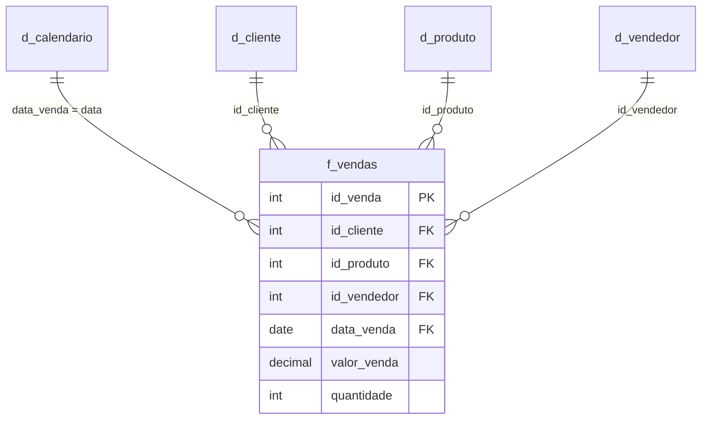

# Modelo Dimensional

Documentação da arquitetura e modelagem dimensional do projeto (Star Schema / Snowflake).

---

## Visão Geral

- **Granularidade da Fato Principal**: (ex: nível de item do pedido / linha de venda)
- **Frequência de Atualização**: Diária / Sob demanda
- **Fonte de Dados**: ERP / Banco de Dados SQL / Planilhas

---

## Diagrama Conceitual (Star Schema)

---

## Regras de Negócio e Relacionamentos

1. **Relacionamentos**: Preferencialmente 1 para N (1:*) com direção de filtro único (Dimensão filtrando Fato).
2. **Surrogate Keys**: Utilização de chaves sintéticas para garantir integridade histórica e performance.
